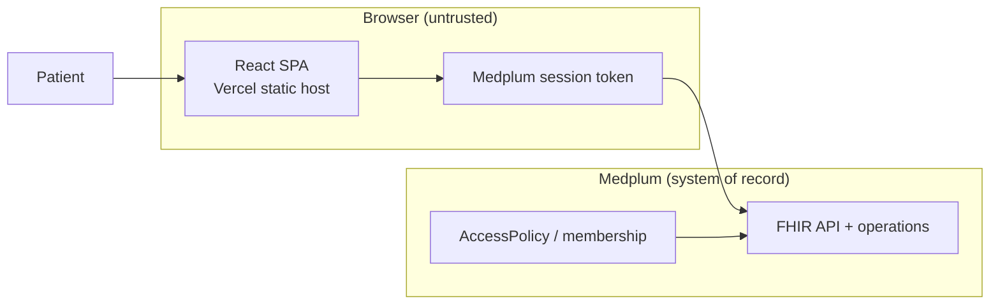
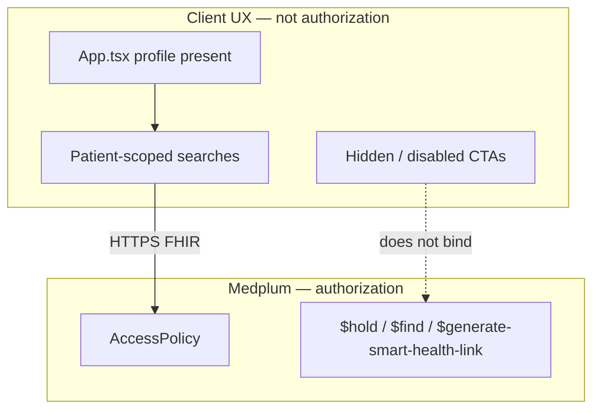

# Foo Medical architecture

Foo Medical is a **thin React patient portal**. [Medplum](https://www.medplum.com/) is the system of record. This SPA renders FHIR data and issues FHIR API calls from the browser. It does not enforce authorization.

**Client-only checks are UX, not authorization.** Booking hours, `Patient.active`, search filters, and profile-present routing can hide or label a path. They cannot stop a scripted client, a second UI, or a raw FHIR call. AccessPolicy, Bots, and FHIR operations on Medplum are the trust boundary.

Do **not** move booking or clinical eligibility into the `App.tsx` profile-present gate. That gate only decides whether the visitor sees the public landing/sign-in/register routes or the signed-in shell.

## Runtime

Hosting is a static Vercel app (`vercel.json` SPA rewrite only). Tokens live in the browser. XSS is session theft.

## Auth and routes

`src/App.tsx` waits for `medplum.isLoading()`, then:

| Session | Routes |
| --- | --- |
| No profile | `/`, `/signin`, `/register`; everything else redirects to `/` |
| Any profile | Signed-in `AppShell` + `src/Router.tsx` |

The signed-in router does not check `resourceType === 'Patient'`. Pages that need a patient cast `getProfile() as Patient`.

Signed-in routes (see `Router.tsx`):

| Path | Page | Notes |
| --- | --- | --- |
| `/` | Home | Hero **Get Care** navigates to `/get-care` |
| `/get-care` | Scheduler | First `Schedule` in the project; `Appointment/$find` and `$hold` |
| `/Communication` | Messages | `ThreadInbox` |
| `/health-record/*` | Chart | Labs, meds, vaccines, vitals, questionnaire responses |
| `/care-plan/*` | Care plans | |
| `/account/profile` | Profile | Full `Patient` `updateResource` |
| `/account/provider` | Provider | Display / TODO, not a write |
| `/account/membership-and-billing` | Billing | Coverage + PaymentNotice searches |
| `/screening-questionnaire` | AHC HRSN | Thank-you only; no FHIR write |
| `/patient-intake-questionnaire` | Intake | Thank-you only; no FHIR write |
| `/Questionnaire/:id` | Questionnaire | Creates `QuestionnaireResponse` |
| `/smart-health-links` | SHL export | `$generate-smart-health-link` |
| `/signout` | Sign out | |

Home still has other CTAs that do not match these routes (`/messages`, a typo provider URL). Those are leftover UX bugs, not a second router.

## FHIR from this client

Authorization is whatever Medplum grants the signed-in membership. Filters below are **query hygiene** so the UI asks for the signed-in patient's rows.

### Reads (typical)

| Resource / operation | Client filter |
| --- | --- |
| `Coverage` | `beneficiary` = signed-in profile |
| `PaymentNotice` | `request:Claim.patient` = signed-in profile |
| `Observation`, `Immunization`, `MedicationRequest` | `patient` |
| `DiagnosticReport`, `CarePlan` | `subject` |
| `QuestionnaireResponse` (list) | `source` |
| `Schedule` | `useSearchOne` — first match in the project |
| `Appointment/$find` | window + service type + that Schedule |

### Writes / operations

| Action | Call |
| --- | --- |
| Profile save | `updateResource(Patient)` (full resource) |
| Add vital | `createResource(Observation)` `status: preliminary` |
| Questionnaire `:id` | `createResource(QuestionnaireResponse)` |
| Get Care hold | `Appointment/$hold` with the profile as participant |
| SMART Health Link | `Patient/{id}/$generate-smart-health-link` |
| Messages | `ThreadInbox` Communication writes |

Screening and intake submit handlers discard the `QuestionnaireResponse`. Medication “Submit Renewal Request” closes a modal and writes nothing.

## Environment and deploy

- `vite.config.ts` copies `.env.defaults` → `.env` on first dev start.
- `.env.defaults` ships a shared demo `MEDPLUM_PROJECT_ID` and example Google / reCAPTCHA site keys. Register on localhost can land in that demo project.
- `vercel.json` is an SPA fallback. It does not set CSP, HSTS, or referrer policy.
- `.vercel` is gitignored so local Vercel project metadata is not committed.

## Trust boundary (short)

When this surface changes (routes, auth gate, FHIR reads/writes, env, deploy headers, trust boundaries), update this folder and `threat-model.md` in the same change.

Tracked leftovers: [threat model](./threat-model.md).
